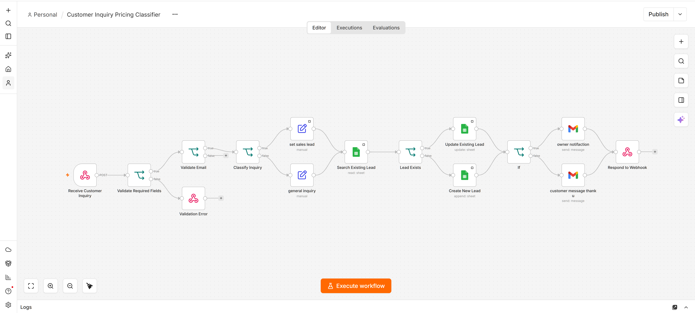

# Customer Inquiry Pricing Classifier

AhsanFlow automation for handling customer product and pricing inquiries through a structured business workflow.

## Overview

Small online businesses often receive repeated customer inquiries about product prices, while the same customer information may also need to be recorded, updated, and shared internally.

This workflow automates that process from inquiry intake to customer response and internal notification.

## Business Problem

A typical customer pricing inquiry can require several manual steps:

- Receive the inquiry
- Validate the submitted customer information
- Determine whether the message is a pricing inquiry
- Check and manage customer/lead information
- Update or create the relevant record
- Notify the business team
- Send a response to the customer

Handling these steps manually for every inquiry creates repetitive work and increases the chance of inconsistent processing.

## What This Automation Does

The workflow follows this general process:

**Customer Inquiry**
→ **Webhook receives the request**
→ **Validate required information**
→ **Validate email**
→ **Classify the inquiry**
→ **Find or update customer/lead data**
→ **Create a new record when required**
→ **Notify the business team**
→ **Send customer response**
→ **Return workflow response**

## Workflow Diagram

## Workflow Logic

### 1. Inquiry Intake

The workflow receives customer information and inquiry data through a webhook.

### 2. Data Validation

Required fields are checked before the workflow continues.

Invalid or incomplete information is handled before the main process runs.

### 3. Inquiry Classification

The workflow checks whether the incoming message is related to pricing.

This version uses rule-based workflow logic rather than an LLM-based AI classifier.

### 4. Customer / Lead Data Handling

The workflow checks the available business data and determines whether the customer record already exists.

Depending on the result, the workflow can:

- Update an existing record
- Create a new record

### 5. Internal Notification

Relevant information is sent to the business team so the inquiry can be monitored and handled appropriately.

### 6. Customer Response

The workflow sends a response back to the customer after the required processing is completed.

## Example

**Customer Inquiry**

> Blue shirt ki price kya hai?

The workflow receives the inquiry, validates the submitted information, identifies the pricing-related request, processes the customer/lead record, and continues through the configured response and notification steps.

## Business Value

This automation is designed to help small online businesses:

- Reduce repetitive manual inquiry handling
- Standardize the inquiry-processing process
- Maintain customer and lead information consistently
- Improve internal visibility of incoming inquiries
- Respond to customers through an automated workflow

## Technology & Integrations

- n8n
- Webhooks
- Google Sheets
- Gmail
- Conditional workflow logic
- Data validation
- API-based workflow communication

## Portfolio Demo

This repository contains a sanitized portfolio version of the workflow.

Real credentials, private customer information, and production business data are not included.

The public workflow is provided for demonstration and portfolio purposes.

## AhsanFlow

AhsanFlow builds practical automation systems for e-commerce and online businesses, with a focus on reducing repetitive manual work and improving business processes.

**Contact:** hello@ahsanflow.com
